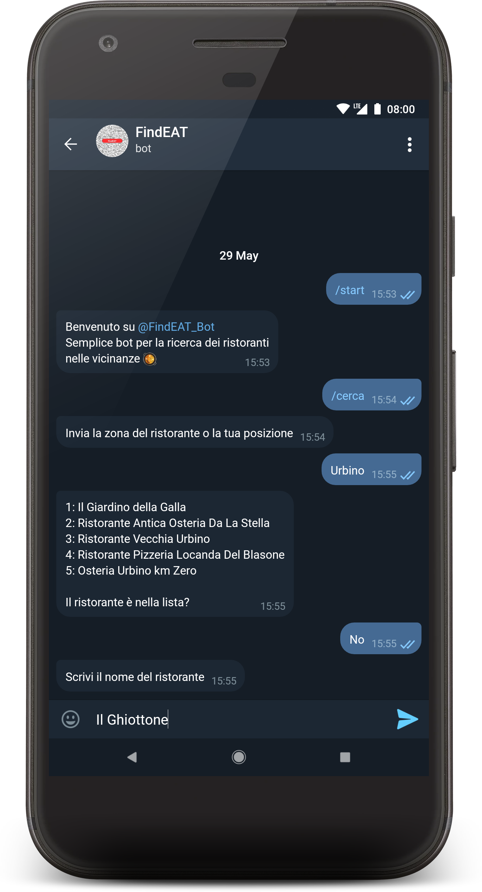
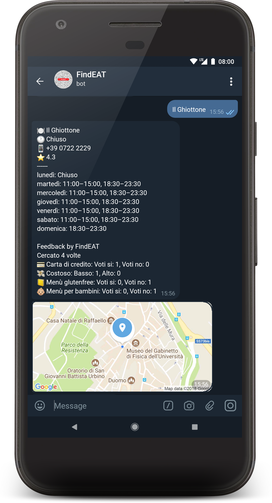

# 🍕 FindEAT 🍽 #
[](https://travis-ci.org/Fast0n/ProgettoPDGT)
[](https://findeatapi.herokuapp.com/)

## Progetto Piattaforme Digitali per la Gestione del Territorio ##

### Appello: ###
* Primo appello sessione estiva 2017/2018

### Alunni: ###
* [Giorgia Giuseppetti](http://github.com/gg97g)
* [Massimiliano Montaleone](http://github.com/Fast0n)

-----------------------------------------------------

### Descrizione ###

Il progetto _FindEAT_ si pone come obbiettivi primari:
* La ricerca dei ristoranti nelle vicinanze
* Inserimento di filtri e feedback 
 * Visualizzazione dei filtri e dei feedback di Google o di FindEAT in base al ristorante cercato


-----------------------------------------------------
### FindEAT API ###
-----------------------------------------------------

### FindEAT_Bot ###
 <div> 
<a></a> 
FindEAT_Bot è il bot pensato per gli utenti che possono comodamente ricercare il loro ristorante preferito. Il bot permette di ricercare per zona o per posizione. Esso ristituisce all’utente i primi 5 ristoranti che riesce a trovare, se il ristorante desiderato non è nella lista è possibile fare una ricerca diretta scrivendo il nome del locale. Una volta trovato, verranno inviate delle informazioni, come: nome, apertura/chiusura, numero di telefono, valutazione, eventuali orari nel caso il ristorante fosse chiuso e la posizione.
 Inoltre vengono visualizzati dei feedback utente come: l’uso del pos, se il costo è mediamente alto o basso e la possibilità di un menù senza glutine o per bambini. Infine i feedback scritti dagli utenti di Google e quelli di FindEAT. 
Questo bot è stato realizzato in Python usando la libreria <a href="https://github.com/nickoala/telepot">Telepot</a> e si interfaccia alle API di FindEAT ed al database di Firebase.
<a></a> 
Abbiamo un solo semplice comando:

```
/cerca: cerca il ristorante per zona o posizione    
```
 
 Ovviamente il bot è una versione ‘lite’, schematizzata e molto semplice da utilizzare e gestire.
  </div><br><br><br>

----------------------------------------------------------

### FindEAT (Client App) ###
Le caratteristiche dell' App sono le seguenti:

  * Cercare tramite zona o posizione i ristoranti
  * Salvare il ristorante preferito
  * Gestire nome, apertura/chiusura, numero di telefono, valutazione, eventuali orari nel caso il ristorante fosse chiuso e la posizione, come descritto nel bot
  * Gestire filtri e feedback di Google e di FindEAT

FindEAT è un’applicazione Android, dove l’utente, può sempre sfruttare le ricerche comOltre al bot riportato sopra e nel bot, ma ha anche la possibilità di salvare i locali che l’utente preferisce e rimanere sempre aggiornato. Inoltre e non meno importante, l’applicazione si collega direttamente ai messaggi per poter prenotare tramite sms. L’applicazione è stata realizzata in Java e anch’essa si interfaccia con le API di FindEAT

***UTILIZZALA ANCHE TUUU!!!*** *FindEAT i ristoranti a portata di App!!*

Molto utile quando si è in vacanza o fuori casa, per trovare un ristorante comodo e alla portarta di qualsiasi utente!

----------------------------------------------------------
### Links e riferimenti ###
 * Link API lista ristoranti Urbino (esempio): https://findeatapi.herokuapp.com/?tipo=luogo&lista=urbino
 * Link alla documentazione del API: https://app.swaggerhub.com/apis/Fast0n/FindEAT/1.0.0-oas3


